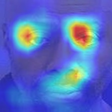

# Deep Regression Forests for Age Estimation

A simple pytorch implementation of [DRFs](https://arxiv.org/pdf/1712.07195).

# Experiments

### Best Hyper-parameters:

batch size: 32

base learning rate:0.2

VGG pretrained: VGG-Face

**or**

batch size: 32

base learning rate:0.05

VGG pretrained: VGG-Face

different learning rate in layers


**MAE**: 2.4~2.5 **CS**: 88%


## Grad-CAM

tree_id: choose a tree 

node_id: choose a node

```
python grad_cam.py --tree_id=0 --node_id=16
```


**example**


